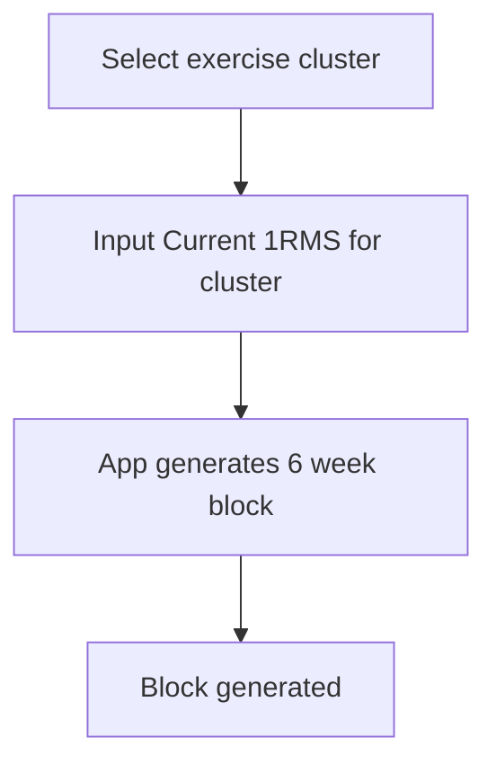
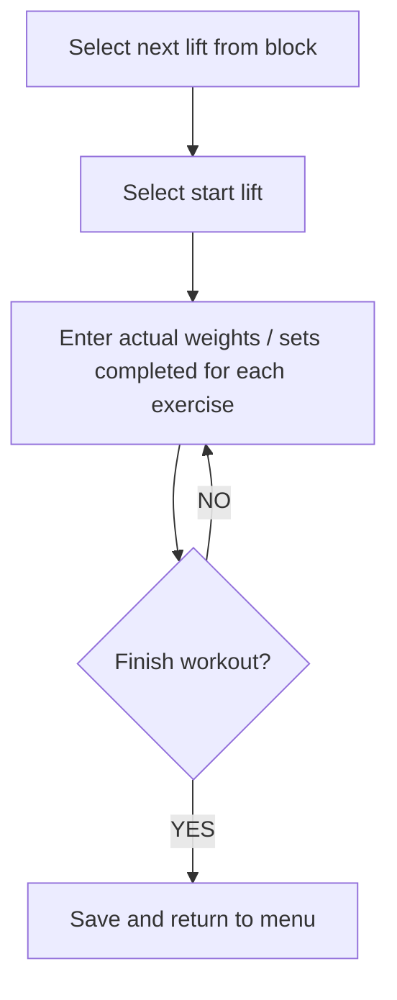

# Loadout Overview

TB Fighter Protocol:
- Two lifts per week
- Same cluster of lifts each day (Overhead Press, Front Squat, Pullups, + Optional Deadlift)
- Number of sets auto-regulated between 3-5
- Reps based on %1RM for the week

## User Flows

### Building a training block

### Logging a lift

## Data Plan

### Lifting

`TrainingBlock`
- id : Int (just a simple counter)
- startDate: Instant

`OneRepMax`
- id: Int
- exercise: Enum
- weight: Double

`Session`
- id: Int
- blockId: Int (FK → TrainingBlock.id)
- date: Instant
- weekNumber: Int (used for weight / reps)

`LiftLog`
- id: Int
- exercise: Enum
- targetWeight: Double (calculated: 1RM x week%)
- targetReps: Int (derived from week number)
- actualWeight: Double? (default null)
- actualReps: Int? (default null)
- setsCompleted: Int (3, 4, or 5)
- sessionId: Int (FK → Session.id)

### User
`Bodyweight`
- id: Int
- date: Instant
- weight: Double

### Running
TBD